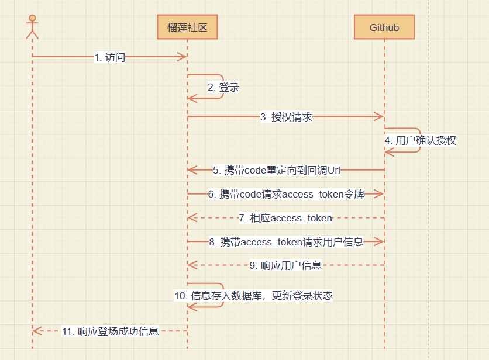

# 毕设项目
## 主题：
* 榴莲社区——基于spring框架的论坛网站。
## 功能：
* 登录功能，基于Github的OAuth授权进行登录挑战，使用Github账号进行登录。
* 登录状态的保存，基于cookie实现登录状态的保存。
* 数据库版本管理，基于flyway插件实现。
* 发布问题功能
* 首页展示问题列表功能
* 列表展示的分页功能
* 添加拦截器进行登录验证

# 资料
* [maven 仓库用于搜索各类依赖](https://mvnrepository.com/)
* [spring 各类组件使用指南](https://spring.io/guides/)
* [spring 基于thymeleaf实现第一个网页](https://spring.io/guides/gs/serving-web-content/)
* [Bootstrap 前端搭建框架](https://www.bootcss.com/)
* [Github OAuth登录授权使用指南](https://docs.github.com/cn/developers/apps/building-oauth-apps/creating-an-oauth-app/)
* [elastic 社区借鉴](https://elasticsearch.cn/explore/)
* [OkHttp 网络请求框架](https://square.github.io/okhttp/)
* [H2 数据库](http://www.h2database.com/html/main.html/)
* [spring 帮助文档](https://docs.spring.io/spring-boot/docs/2.0.0.RC1/reference/htmlsingle/#boot-features-embedded-database-support)
* [spring 集成 mybatis ](https://mybatis.org/spring-boot-starter/mybatis-spring-boot-autoconfigure/)
* [Flyway 插件管理数据库版本](https://flywaydb.org/documentation/getstarted/firststeps/maven/)
* [Lombok 插件简化代码](http://wjhsh.net/janes-p-9242497.html/)
* [thymeleaf 操作文档](http://thymeleaf.org/doc/tutorials/3.0/usingthymeleaf.html#iteration/)
* [jquery 官网](https://jquery.com/)

# 工具
* [git 远程管理github仓库](https://git-scm.com/)
* [Xmind 思维导图绘制软件](https://xmind.cn/)
* [迅捷画图 UML图绘制](https://www.liuchengtu.com/)

# 知识点小结
## OAuth登录
### OAuth协议介绍：
待补充。。。。
### 主要流程如下：
* ① 用户被开发站点重定向到Github指定的URL，请求Github账号授权
* ② 用户被Github重定向回开发站点
* ③ 开发站点使用用户的令牌访问Github的API
### 流程细节讲解：
* ① 用户再开发站点执行登录逻辑
* ② 用户被开发站点重定向到Github指定的URL，携带上回调函数等必要参数，请求Github账号授权（使用一个超链接带上参数get请求）
* ③ Github授权成功后，返回有失效性的code，并重定向回开发站点提供的回调函数
* （重定向到上一步参数中给出的回调函数地址，带上code等参数）
* ④ 回调函数接收code并携带code请求令牌 （回调函数中实现code的抽取，并携带code访问token接口获取access_token，获得access_token后访问user接口获取user的数据）
* ⑤ Github给出令牌
* ⑥ 开发站点使用令牌访问用户数据
* ⑦ Github给出用户数据
### UML图如下：
