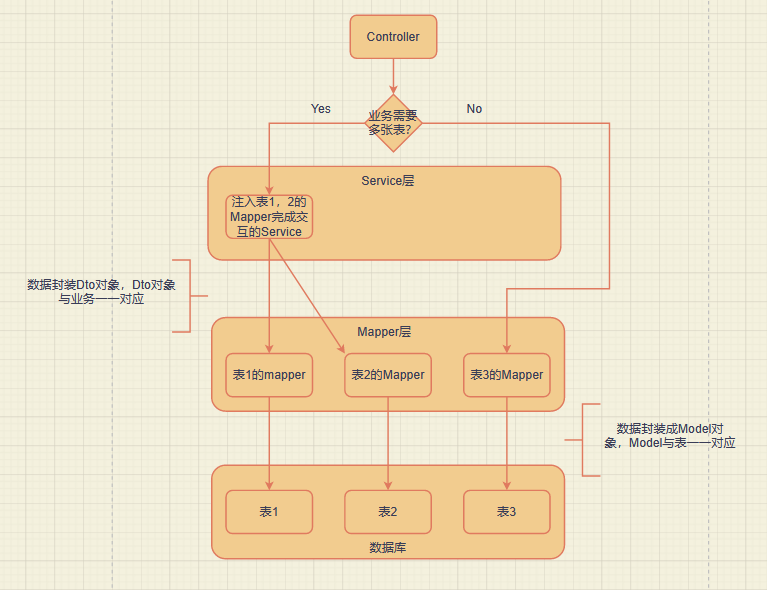

# 毕设项目
## 主题：
* 榴莲社区——基于spring框架的论坛网站。
## 功能：
* 登录功能，基于Github的OAuth授权进行登录挑战，使用Github账号进行登录。
* 登录状态的保存，基于cookie实现登录状态的保存。
* 数据库版本管理，基于flyway插件实现。
* 发布问题功能
* 首页展示问题列表功能
* 列表展示的分页功能
* 添加拦截器进行登录验证
* 问题详情介绍界面
* 使用mybatis generator自动根据数据库表结构生成mapper对象
* 使用ControllerAdvice和ExceptionHandler统一处理异常
* 问题阅读数量统计功能
* 问题评论功能

# 资料
* [maven 仓库用于搜索各类依赖](https://mvnrepository.com/)
* [spring 各类组件使用指南](https://spring.io/guides/)
* [spring 基于thymeleaf实现第一个网页](https://spring.io/guides/gs/serving-web-content/)
* [Bootstrap 前端搭建框架](https://www.bootcss.com/)
* [Github OAuth登录授权使用指南](https://docs.github.com/cn/developers/apps/building-oauth-apps/creating-an-oauth-app/)
* [elastic 社区借鉴](https://elasticsearch.cn/explore/)
* [OkHttp 网络请求框架](https://square.github.io/okhttp/)
* [H2 数据库](http://www.h2database.com/html/main.html/)
* [spring 帮助文档](https://docs.spring.io/spring-boot/docs/2.0.0.RC1/reference/htmlsingle/#boot-features-embedded-database-support)
* [spring 集成 mybatis ](https://mybatis.org/spring-boot-starter/mybatis-spring-boot-autoconfigure/)
* [Flyway 插件管理数据库版本](https://flywaydb.org/documentation/getstarted/firststeps/maven/)
* [Lombok 插件简化代码](http://wjhsh.net/janes-p-9242497.html/)
* [thymeleaf 操作文档](http://thymeleaf.org/doc/tutorials/3.0/usingthymeleaf.html#iteration/)
* [jquery 官网](https://jquery.com/)
* [Mybatis Generator 操作文档](http://mybatis.org/generator/index.html)
* [Postman 在线使用（前端没有搭起来时用于调试后端接口）](https://v7.apipost.cn/apis/)

# 工具
* [git 远程管理github仓库](https://git-scm.com/)
* [Xmind 思维导图绘制软件](https://xmind.cn/)
* [迅捷画图 UML图绘制](https://www.liuchengtu.com/)

# 知识点小结
## OAuth登录
### OAuth协议介绍：
待补充。。。。
### 主要流程如下：
* ① 用户被开发站点重定向到Github指定的URL，请求Github账号授权
* ② 用户被Github重定向回开发站点
* ③ 开发站点使用用户的令牌访问Github的API
### 流程细节讲解：
* ① 用户再开发站点执行登录逻辑
* ② 用户被开发站点重定向到Github指定的URL，携带上回调函数等必要参数，请求Github账号授权（使用一个超链接带上参数get请求）
* ③ Github授权成功后，返回有失效性的code，并重定向回开发站点提供的回调函数
* （重定向到上一步参数中给出的回调函数地址，带上code等参数）
* ④ 回调函数接收code并携带code请求令牌 （回调函数中实现code的抽取，并携带code访问token接口获取access_token，获得access_token后访问user接口获取user的数据）
* ⑤ Github给出令牌
* ⑥ 开发站点使用令牌访问用户数据
* ⑦ Github给出用户数据
### 图解：


## 基于cookie机制实现登录状态的保存
### 默认模式：
- 默认情况下的登录流程如下：用户使用OAuth协议完成登录后，后端会在session中存放一个user对象，保存的是用户的一些信息，这个session我们直接通过request对象获取即可，是tomcat默认生成的，同时会返回前端一个sessionId，如果要做登录状态的保存其实也可以通过sessionId实现，将其存入数据库中，对每个请求查看有无sessionId，如果有且在数据库中有记录则为登录状态。
### 修改后的模式：
- 修改后的流程如下：用户使用OAuth协议完成登录后，后端会为每个用户生成一个token作为令牌，这个token使用UUID生成，然后把token放入cookie中，这个cookie对象我们通过response对象获取即可，然后将token存入数据库中，对每个请求查看cookie中有无token，如果有且在数据库中有记录则为登录状态。

## 后端开发三层架构之间的关系
### 概述：
- 后端开发主要有Controller，Service，Mapper三个层。他们之间的调用关系如下：首先我们有一个数据库用于存储各类数据，数据库中的每一张表对应一个Model对象，Model中的对象都是最基本的Bean，由get set函数和一些属性构成，Mapper对象通过注入一个唯一的Model对象操作唯一的一张表，即Mapper和Model之间是一对一的调用关系。当Controller需要某一类数据的时候，比如用户的个人信息，那么这些数据都存在于User表中，Controller直接注入一个UserMapper就可以获取User表中的数据返回一个存有数据的UserModel。当然对于一些复杂的业务场景，可能同时需要两张表的信息，这时一个Mapper对象是解决不了的我们就需要注入多个Mapper，然后还需要实现多个Mapper之间的交互，这些操作写在Controller中会让Controller的代码过于杂乱，我们一般通过Service完成Mapper之间的交互，Service可以注入多个Mapper，完成交互然后返回数据给Controller，而数据的返回格式是Dto对象，这类对象不对应任何一张数据库表，它往往与业务需求相关联，是一个满足特定业务需求的数据存储对象，它的属性往往由多个数据库表的属性组成。因此当Controller层的业务需求涉及一张表时可以直接调用Mapper层，涉及多个表时可以抽象出Service层，Service层调用Mapper完成多表交互。
### 图解：


## MBG（MyBatis Generator）
### 概述：
- 用于根据数据库表自动生成对应的model、mapper以及mapper对应的xml文件用于实现mapper中的sql语句，因此需要配置好三者的路径。配置好后，对于默认没有生成的一些sql语句可以使用生成的modelExample对象完成sql的拼接，而不需要自己手动写xml

## 异常处理
### 概述：
- 异常处理的基本思路: controller 和 service完成异常的抛出（service抛出也是在controller中接收）这样所有的异常都能被CustomizeExceptionHandler拦截然后根据不同异常类型进行处理，对于一些API接口返回json格式的数据（一般包含从异常中获取的code 和 message两部分），其他url则跳转到error页面，获取异常的code 和 message进行展示
### 具体实现:
- 首先定义一个IErrorCode接口，它包含有getCode和getMessage两个方法。
- 其次对于每一个功能模块（或者其他划分单位如每个Controller、Service）我们可以定义一个枚举对象ErrorCode，每个枚举对象有code和message两个属性，用来定义每个异常对应的code和message。然后这个枚举对象必须实现IErrorCode接口。
- 到这里对于每个功能模块我们都有了对应的异常枚举，缺的就是异常对象了，我们定义一个异常对象，他的有参构造是接受一个异常枚举ErrorCode（当然写的是接口IErrorCode，这样可以利用多态，提高可扩展性）。这个异常对象拥有code和message两个属性对应每个枚举对象的两个属性。
- 这样我们可以通过定义一个ExceptionHandler对象对异常进行拦截，然后根据是API接口还是页面异常选择返回JSON数据还是跳转error页面展示异常message

## 阅读数量统计
### 概述：
- 每次访问问题详情页面URL时阅读量加一，即在Controller实现。 
### 存在问题：
- 高并发时存在问题，因为n个用户可能同时拿到了相同的初始阅读量值然后各自加一后写回，导致最后只加一。
### 解决方法：
- 加锁可以直接解决但编码相对麻烦且开销大。此处我们考虑使用sql语句解决，原本是在代码中实现加一然后update语句写回，现在改成直接在update中追加，即每次运行sql语句都加一就行了，不需要手动编码计算加一。

## 回复功能（API开发）
### 具体实现：
- 首先开发一个API，功能是接收回复内容等相关数据，返回的是JSON格式的响应数据，包括code和message，接口也实现了一些异常的检测，抛出后交由异常处理模块统一处理（此处因为是API抛出的异常会判断后返回JSON数据”异常处理“部分已经说明，不再赘述。），使用postman进行测试。
- 由于回复功能处理要将回复内容写入Comment表外，还需要在question中增加评论数量，因此使用事务保证两个操作的原子性。
- 对于前端界面，使用ajax异步提交post请求到API，然后根据API返回不同的code进行判断，这样不刷新页面就可以实现局部数据的更新。
- 如果回复时发现未登录（根据response code判断） 给出一个直接跳转登录的按钮。跳转登录后要把新页面关闭，使用localStorage存储关闭页面的参数，判断后即可进行页面关闭。


# 脚本
```bash
mvn flyway:migrate
mvn -Dmybatis.generator.overwrite=true mybatis-generator:generate
```

# 待改进
- 把所有的错误 包括未登录等等 都作为异常抛出在异常处理对象那里进行统一的拦截，在error界面进行统一展示
- 或者是所有页面异常 比如不存在这个页面等 都跳转error页面进行展示，而其他异常不跳转以JSON格式返回 方便api测试
- 目前在CustomizeExceptionHandler中实现 但有待改进