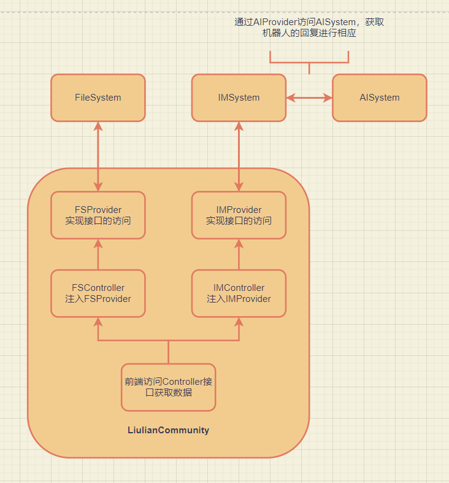

# 毕设项目
## 主题：
* 榴莲社区——基于spring框架的论坛网站。
## 功能：
* 登录功能，基于Github的OAuth授权进行登录挑战，使用Github账号进行登录。
* 登录状态的保存，基于cookie实现登录状态的保存。
* 数据库版本管理，基于flyway插件实现。
* 发布问题功能
* 首页展示问题列表功能
* 列表展示的分页功能
* 添加拦截器进行登录验证
* 问题详情介绍界面
* 使用mybatis generator自动根据数据库表结构生成mapper对象
* 使用ControllerAdvice和ExceptionHandler统一处理异常
* 问题阅读数量统计功能
* 问题评论功能
* 相关问题推荐功能
* 问题编辑功能实现markdown支持
* 问题编辑提高图片上传功能，借助bridge文件服务器实现
* 网站生成日志功能
* 搜索功能
* 热门话题功能
* 流量变现功能
* 在线聊天功能，包括 1.和系统机器人聊天 2.发布全站消息 3. 与互关好友私聊
* 久坐活动提示功能，使用mediaPipe进行脸部关键点识别指导用户活动颈部

# 资料
* [elastic 社区（开发借鉴）](https://elasticsearch.cn/explore/)
* [Jack Cui 个人博客（开发借鉴）](https://cuijiahua.com/)
* [maven 仓库用于搜索各类依赖](https://mvnrepository.com/)
* [spring 各类组件使用指南](https://spring.io/guides/)
* [spring 基于thymeleaf实现第一个网页](https://spring.io/guides/gs/serving-web-content/)
* [Bootstrap 前端搭建框架](https://www.bootcss.com/)
* [Github OAuth登录授权使用指南](https://docs.github.com/cn/developers/apps/building-oauth-apps/creating-an-oauth-app/)
* [OkHttp 网络请求框架](https://square.github.io/okhttp/)
* [H2 数据库](http://www.h2database.com/html/main.html/)
* [spring 帮助文档](https://docs.spring.io/spring-boot/docs/2.0.0.RC1/reference/htmlsingle/#boot-features-embedded-database-support)
* [spring 集成 mybatis ](https://mybatis.org/spring-boot-starter/mybatis-spring-boot-autoconfigure/)
* [Flyway 插件管理数据库版本](https://flywaydb.org/documentation/getstarted/firststeps/maven/)
* [Lombok 插件简化代码](http://wjhsh.net/janes-p-9242497.html/)
* [thymeleaf 操作文档](http://thymeleaf.org/doc/tutorials/3.0/usingthymeleaf.html#iteration/)
* [jquery 官网](https://jquery.com/)
* [Mybatis Generator 操作文档](http://mybatis.org/generator/index.html)
* [Postman 在线使用（前端没有搭起来时用于调试后端接口）](https://v7.apipost.cn/apis/)
* [comment.js 官网，用于时间戳的转换](http://momentjs.cn/)
* [Editor.md 可嵌入markdown编辑器](https://pandao.github.io/editor.md/)
* [codepen 前端UI设计网站](https://codepen.io/trending)
* [APlayer 音乐播放器](https://aplayer.js.org/#/)
* [MetingJS 封装APlayer开箱即用快速实现背景音乐](https://github.com/metowolf/MetingJS)
* [MetingJS 配合 APlayer使用实现背景音乐教程](https://www.cnblogs.com/fby698/p/12663089.html)
* [Trec06c 垃圾邮件数据集](https://plg.uwaterloo.ca/cgi-bin/cgiwrap/gvcormac/foo06)
* [Bert模型识别垃圾邮件教程](https://www.cnblogs.com/NosenLiu/p/14956415.html)
* [SVM模型识别垃圾邮件教程](https://www.shuzhiduo.com/A/GBJrQYbEz0/)
* [designGradients渐变颜色搭配网站](https://www.designgradients.com/)
* [DFA算法实现敏感词过滤](https://blog.csdn.net/henshuia/article/details/111498753)

# 工具
* [git 远程管理github仓库](https://git-scm.com/)
* [Xmind 思维导图绘制软件](https://xmind.cn/)
* [迅捷画图 UML图绘制](https://www.liuchengtu.com/)

# 知识点小结
## OAuth登录
### OAuth协议介绍：
待补充。。。。
### 主要流程如下：
* ① 用户被开发站点重定向到Github指定的URL，请求Github账号授权
* ② 用户被Github重定向回开发站点
* ③ 开发站点使用用户的令牌访问Github的API
### 流程细节讲解：
* ① 用户再开发站点执行登录逻辑
* ② 用户被开发站点重定向到Github指定的URL，携带上回调函数等必要参数，请求Github账号授权（使用一个超链接带上参数get请求）
* ③ Github授权成功后，返回有失效性的code，并重定向回开发站点提供的回调函数
* （重定向到上一步参数中给出的回调函数地址，带上code等参数）
* ④ 回调函数接收code并携带code请求令牌 （回调函数中实现code的抽取，并携带code访问token接口获取access_token，获得access_token后访问user接口获取user的数据）
* ⑤ Github给出令牌
* ⑥ 开发站点使用令牌访问用户数据
* ⑦ Github给出用户数据
### 图解：


## 基于cookie机制实现登录状态的保存
### 默认模式：
- 默认情况下的登录流程如下：用户使用OAuth协议完成登录后，后端会在session中存放一个user对象，保存的是用户的一些信息，这个session我们直接通过request对象获取即可，是tomcat默认生成的，同时会返回前端一个sessionId，如果要做登录状态的保存其实也可以通过sessionId实现，将其存入数据库中，对每个请求查看有无sessionId，如果有且在数据库中有记录则为登录状态。
### 修改后的模式：
- 修改后的流程如下：用户使用OAuth协议完成登录后，后端会为每个用户生成一个token作为令牌，这个token使用UUID生成，然后把token放入cookie中，这个cookie对象我们通过response对象获取即可，然后将token存入数据库中，对每个请求查看cookie中有无token，如果有且在数据库中有记录则为登录状态。

## 后端开发三层架构之间的关系
### 概述：
- 后端开发主要有Controller，Service，Mapper三个层。他们之间的调用关系如下：首先我们有一个数据库用于存储各类数据，数据库中的每一张表对应一个Model对象，Model中的对象都是最基本的Bean，由get set函数和一些属性构成，Mapper对象通过注入一个唯一的Model对象操作唯一的一张表，即Mapper和Model之间是一对一的调用关系。当Controller需要某一类数据的时候，比如用户的个人信息，那么这些数据都存在于User表中，Controller直接注入一个UserMapper就可以获取User表中的数据返回一个存有数据的UserModel。当然对于一些复杂的业务场景，可能同时需要两张表的信息，这时一个Mapper对象是解决不了的我们就需要注入多个Mapper，然后还需要实现多个Mapper之间的交互，这些操作写在Controller中会让Controller的代码过于杂乱，我们一般通过Service完成Mapper之间的交互，Service可以注入多个Mapper，完成交互然后返回数据给Controller，而数据的返回格式是Dto对象，这类对象不对应任何一张数据库表，它往往与业务需求相关联，是一个满足特定业务需求的数据存储对象，它的属性往往由多个数据库表的属性组成。因此当Controller层的业务需求涉及一张表时可以直接调用Mapper层，涉及多个表时可以抽象出Service层，Service层调用Mapper完成多表交互。
### 图解：


## MBG（MyBatis Generator）
### 概述：
- 用于根据数据库表自动生成对应的model、mapper以及mapper对应的xml文件用于实现mapper中的sql语句，因此需要配置好三者的路径。配置好后，对于默认没有生成的一些sql语句可以使用生成的modelExample对象完成sql的拼接，而不需要自己手动写xml

## 异常处理
### 概述：
- 异常处理的基本思路: controller 和 service完成异常的抛出（service抛出也是在controller中接收）这样所有的异常都能被CustomizeExceptionHandler拦截然后根据不同异常类型进行处理，对于一些API接口返回json格式的数据（一般包含从异常中获取的code 和 message两部分），其他url则跳转到error页面，获取异常的code 和 message进行展示
### 具体实现:
- 首先定义一个IErrorCode接口，它包含有getCode和getMessage两个方法。
- 其次对于每一个功能模块（或者其他划分单位如每个Controller、Service）我们可以定义一个枚举对象ErrorCode，每个枚举对象有code和message两个属性，用来定义每个异常对应的code和message。然后这个枚举对象必须实现IErrorCode接口。
- 到这里对于每个功能模块我们都有了对应的异常枚举，缺的就是异常对象了，我们定义一个异常对象，他的有参构造是接受一个异常枚举ErrorCode（当然写的是接口IErrorCode，这样可以利用多态，提高可扩展性）。这个异常对象拥有code和message两个属性对应每个枚举对象的两个属性。
- 这样我们可以通过定义一个ExceptionHandler对象对异常进行拦截，然后根据是API接口还是页面异常选择返回JSON数据还是跳转error页面展示异常message

## 阅读数量统计
### 概述：
- 每次访问问题详情页面URL时阅读量加一，即在Controller实现。 
### 存在问题：
- 高并发时存在问题，因为n个用户可能同时拿到了相同的初始阅读量值然后各自加一后写回，导致最后只加一。
### 解决方法：
- 加锁可以直接解决但编码相对麻烦且开销大。此处我们考虑使用sql语句解决，原本是在代码中实现加一然后update语句写回，现在改成直接在update中追加，即每次运行sql语句都加一就行了，不需要手动编码计算加一。

## 回复功能（API开发）
### 具体实现：
- 首先开发一个API，功能是接收回复内容等相关数据，返回的是JSON格式的响应数据，包括code和message，接口也实现了一些异常的检测，抛出后交由异常处理模块统一处理（此处因为是API抛出的异常会判断后返回JSON数据”异常处理“部分已经说明，不再赘述。），使用postman进行测试。
- 由于回复功能处理要将回复内容写入Comment表外，还需要在question中增加评论数量，因此使用事务保证两个操作的原子性。
- 对于前端界面，使用ajax异步提交post请求到API，然后根据API返回不同的code进行判断，这样不刷新页面就可以实现局部数据的更新。
- 如果回复时发现未登录（根据response code判断） 给出一个直接跳转登录的按钮。跳转登录后要把新页面关闭，使用localStorage存储关闭页面的参数，判断后即可进行页面关闭。

## 评论列表展示（API开发）
- 一级评论是每次请求页面时在Controller中调用查询数据库的功能，然后把数据放入model中传递到页面，页面获取数据后展示。二级评论不能这么做，如果每次加载页面时都要先把所有二级评论加载好放入model中，那么页面请求会变慢，而且二级评论默认是关闭的，我们只需要在点击时显示就行，因此作为一个API，访问二级评论的API时给出父评论Id返回子评论数据，然后在前端展示即可。也就是之前回复功能API接口返回code和message的基础上再返回一个data数据就行。而且只有返回一个页面时才能加上model，返回JSON的API接口model和前端某一个界面是绑定不了的。
- 二级评论提交页面刷新后仍然保持展开的功能：每次提交二级评论时，把当前二级评论父节点的id写入localStorage，每次页面加载到最后，运行script脚本读取id将其二级评论展开即可。

## 文件管理系统（FileSystem）
- markdown中的图片数据不存储在本项目中，而是存储在easy-fs即另一个文件管理系统中。使用FSProvider实现对文件系统上传接口的访问，前端调用FileController，FileController注入FSProvider实现上传接口访问，将图片数据上传到文件系统中。

## 即时通讯系统（IMSystem）
- 即时通讯功能不在本项目中实现，而是借助IMSystem项目，这是一个即时通讯服务器，可以进行消息的转发和聊天信息的存储。
- 本项目实现前端的通讯界面，使用JS实现webSocket对象的创建，可以直接与IMSystem进行全双工通讯，IMSystem进行消息的转发，后续考虑IMSystem访问AISystem实现智能回复。 
### 为什么要使用webSocket？
- webSocket可以实现全双工通讯，如果使用http协议，请求只能由客户端发起，服务端响应，客户端必须使用轮询的方式监听服务端是否发来消息，这十分浪费资源。而webSocket可以实现全双工通讯，双方都可以主动发起请求。
### JAVA创建webSocket客户端还是JS创建webSocket客户端？
- 使用JS存在的问题：每次切换页面都会导致webSocket对象关闭，JAVA实现的话我们可以手动生成和销毁webSocket对象与网页切换无关。 使用JAVA存在的问题：JAVA接收到服务器传来的消息后要传递给前端，这时需要使用rabbitmq等消息队列组件或者前端轮询，这就与使用webSocket的初衷相违背了。
- 本项目使用JS创建webSocket，为了解决切换界面webSocket被销毁的问题，我们在IMSystem中对历史聊天记录进行备份，webSocket虽然销毁但聊天记录会一直保存，每次前端创建新webSocket对象时，查询是否有历史记录如果有则返回前端显示，这样看起来就是一直保持连接了。
- 前端在请求历史聊天记录的时候直接访问IMSystem的接口存在跨域的问题，因此，我们让前端访问本项目的controller，controller注入IMProvider，使用OKHttp实现历史记录的请求，这样可以解决跨域问题。

## 人工智能系统（AISystem）
- 使用GPT模型，在三种数据集上进行训练，得到三个机器人客服。
- 使用Flask部署，提供机器人聊天接口。
- IMSystem接收到用户的消息后，调用AISystem的机器人聊天接口，得到机器人的回复，将回复消息发送到社区。

## 第三方系统的嵌入模式


## DFA算法实现敏感词过滤
- 待补充

# 脚本
```bash
# 将数据库迁移到mysql后不再使用
mvn flyway:migrate
mvn -Dmybatis.generator.overwrite=true mybatis-generator:generate
```

# 待改进
- 把所有的错误 包括未登录等等 都作为异常抛出在异常处理对象那里进行统一的拦截，在error界面进行统一展示
- 或者是所有页面异常 比如不存在这个页面等 都跳转error页面进行展示，而其他异常不跳转以JSON格式返回 方便api测试
- 目前在CustomizeExceptionHandler中实现 但有待改进
- 各种异常使用弹窗提示
- 我的问题界面添加问题删除功能
- 添加点赞功能
- 分页列表 当列表为空时 展示空列表icon
- 相关问题取top k个即可
- 每个用户有主页信息
- 导航栏如何获取未读信息数量？(用js脚本请求一下数据库) ->已经修复使用session存储数据这样可以在全局获取
- 最新回复消息显示时间等信息 类似我的问题界面
- 提问时标签悬浮鼠标变成一只手的实现
- 评论文本框改成之前文件系统的富文本编辑器
- 社区和文件服务器单点登录
- 增加图片上传功能抛出异常
- 基于ES的搜索功能
- 基于spring 定时器的热门话题功能
- 单独的标签页面
- 使用免费api丰富页面内容 ：https://www.mxnzp.copp'rm/
- 搞一个后台系统 1. 用户登录可以看自己的一些统计数据 2. 管理员登录可以进行活动和文件等的上传以及对用户信息进行一些操作和查看
- 深度学习模块：1. 垃圾邮件分类模型 2. 黄色图片识别 3. 敏感词屏蔽（为了防止漏检还应添加举报功能）
- 基于netty进行实时通讯如站内邮件功能
- 修改<hr> background 为深蓝色
- 手动登出就不要记住登录状态自动登录了
- 实现单点登录
- 聊天功能：初始化时给出一些提示语句说明如何使用，例如可以通过口令切换不同的机器人，不过首先是得训练好一个闲聊机器人
- 私聊对象必须互关，互关的判断
- 本地数据库的数据不见了！！！！
- OCR检测图片是否有敏感词汇（https://github.com/JaidedAI/EasyOCR）
- 色情暴力图片检测
- 把肩颈活动倒计时设置为全局倒计时，防止发生页面跳转就重新计时

## ElasticSearch
端口9200